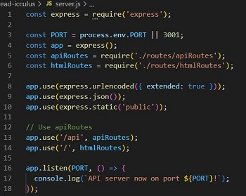
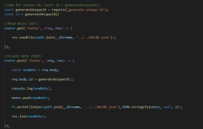

# Note Taker

## Description:
This is an application built to allow user to write/save notes with the potential to delete them as well.  I primarily utilized my developing skill sets in express.js and node.js create this application.  The application was also deployed to Heroku.  Some of the methods and skills I used are shown below:

* Express.js was utilized to start the server

* Generate-Unique-ID npm package installed to help create a unique id for each note and Get and Post routes created for (/api/notes):

## Installation:
Installation requiements include:

* npm install express generate-unique-id --save

## Application Deployment:

Please visit the deployed application: [The Note-Taker](https://murmuring-sands-28795.herokuapp.com/)

## License:
[MIT License](https://choosealicense.com/licenses/mit/)

## Contributing:
Please refer to [Contributor Covenant](https://www.contributor-covenant.org/) for guidelines.

## Questions:
Please do not hesitate to reach out to me directly with additional questions via my email address or Github Profile below:
  
* Email: [erin.michon@gmail.com](mailto:erin.michon@gmail.com) 
* Github Profile: [erin-michon](https://github.com/erin-michon) 